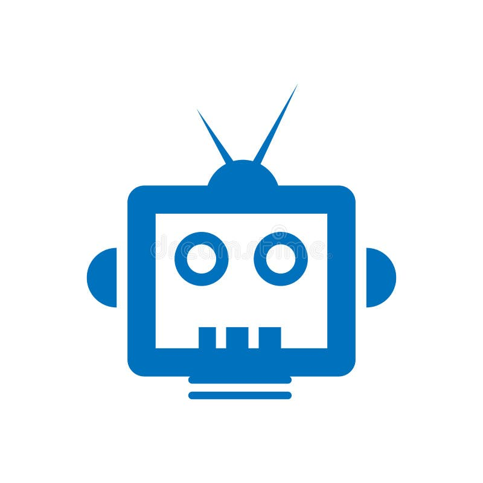

# Garud AI Robot Control Panel

[](https://github.com/Preet3627/Garud_AI/releases/tag/v0.1.4)
[](LICENSE)

An advanced, visually stunning Electron-based control panel for the Garud AI Robot. This application serves as the "brain" for the Garud AI hardware, providing a bridge between advanced AI models and physical robot control.



## 🆕 Latest Update: v0.1.4
This version introduces a major architectural upgrade and professional deployment options.
- **FastAPI Migration**: High-performance, asynchronous AI bridge for faster voice processing.
- **Docker Support**: One-command deployment for the AI "brain" on any hardware.
- **Clean Releases**: Optimized release workflow that only provides essential `.exe`, `.dmg`, and `.AppImage` binaries.
- **Read the full [v0.1.4 Release Notes](release-notes/v0.1.4.md)**.

## 🚀 Key Features

### 🧠 Intelligence & Vision
- **Multi-Provider AI**: Support for Ollama (local), OpenAI, Gemini, and Claude.
- **Vision Support**: Captured screenshots and device camera frames are analyzed by the AI for contextual understanding.
- **Computer Use Tools**: Garud AI can interact with your OS—executing commands, opening files/URLs, managing your clipboard, and listing directories.
- **Autonomous Function Calling**: A recursive tool-loop allowing the AI to chain multiple system actions to fulfill complex requests.

### 🎙️ Garud Voice Mode (Powered by FastAPI)
- **Hands-Free Wake Word**: Activate the assistant by saying "Hey Garud" (customizable).
- **Advanced Voice-to-Text**: High-accuracy browser-based STT.
- **Natural Persona**: Optimized conversational mode for a more "alive" assistant experience.
- **Stunning UI/UX**: Reactive AI Orb and voice waveforms that respond to your voice and the AI's speech.

### 🐳 Docker Deployment (AI Bridge)
You can now run the Garud AI bridge inside a Docker container for maximum stability:
```bash
# Build the image
docker build -t garud-ai-bridge .

# Run the container
docker run -d -p 5002:5002 --name garud-brain garud-ai-bridge
```

### 🛡️ Security & Stability
- **Command Risk Tiers**: Hardcoded classification (LOW, MEDIUM, HIGH) for all shell commands.
- **Biometric Authentication**: 
  - **macOS**: Touch ID verification required for high-risk commands.
  - **Windows**: Windows Hello / Admin Elevation prompts for system-level changes.
- **Permission Management**: Automated macOS accessibility and camera permission handling to prevent "black screen" issues.

### 🤖 Robot Integration
- **Auto-Discovery**: Automatic detection of Garud AI robots on the local network using Bonjour/mDNS.
- **Remote Execution**: Direct SSH-based deployment and management of robot server logic.
- **Testing Mode**: Full AI and Voice functionality available even without a physical robot connected.

## 🛠️ Technical Stack
- **Frontend**: React 19, Vite, Tailwind CSS, Framer Motion (for animations).
- **Desktop**: Electron 34, Preload-bridge for secure IPC communication.
- **AI Integration**: Custom FastAPI implementation supporting OpenAI-compatible APIs and Ollama.
- **Icons**: Lucide React.

## 🚥 Getting Started

### Prerequisites
- Node.js (v18+)
- npm or yarn
- Ollama (optional, for local AI)
- Docker (optional, for containerized deployment)

### Installation
1. Clone the repository:
   ```bash
   git clone https://github.com/Preet3627/Garud_AI.git
   cd Garud_AI
   ```
2. Install dependencies:
   ```bash
   npm install
   ```
3. Start the development server:
   ```bash
   npm run electron:dev
   ```

## 📜 Licensing
**Copyright (c) 2026 Garud AI Team. All Rights Reserved.**

This project is proprietary and confidential. Unauthorized copying, distribution, or use of this software is strictly prohibited. See the `LICENSE` file for details.

## 🤝 Contributing
Contributions are welcome! Please feel free to submit a Pull Request.

---
**Garud AI Team** - *Bringing Intelligence to Motion.*
